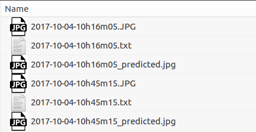

Used darknet by https://github.com/AlexeyAB/darknet.  

For information regarding darknet, please refer to https://github.com/pjreddie/darknet.  

Modified it to run detector test on multiple images and save each image with bounding boxes, as well as co-ordinates of the bounding box in a text file.  

Please refer to https://github.com/AlexeyAB/darknet for requirements and installation instructions.

I have run the code to detect just 1 class (person) in images.
Please refer to https://timebutt.github.io/static/how-to-train-yolov2-to-detect-custom-objects/ for modifications as per the required detection class.


Usage (Only for detector test):

```
./darknet detector test cfg/person.data cfg/yolo-person.cfg darknet19_448.conv.23.weights -dont_show -save_labels < data/train.txt > result.txt
```

Make sure you edit the ```person.data``` ,```yolo-person.cfg```, as per the instructions given in https://timebutt.github.io/static/how-to-train-yolov2-to-detect-custom-objects/.

```darknet19_448.conv.23.weights``` is NOT the trained weight file, make sure you put the appropriate path of the weights file, or put the weights file in the same directory.

```data/train.txt``` file should contain absolute path of all the images in a directory.

Example:
```
/media/pratikbhave2/Local_Disk/tst2/2017-10-04-10h16m05.JPG
/media/pratikbhave2/Local_Disk/tst2/2017-10-04-10h45m15.JPG
/media/pratikbhave2/Local_Disk/tst2/2017-10-04-11h14m25.JPG
/media/pratikbhave2/Local_Disk/tst2/2017-10-04-11h43m35.JPG
```

Output format:
In the directory listed under ```data/train.txt``` you would get output as shown below:



```2017-10-04-10h16m05.JPG``` - Original Image  
```2017-10-04-10h16m05.txt``` - Text file with class number and bounding box co-ordinates  
```2017-10-04-10h16m05_predicted.jpg``` - Output image with bounding box  


